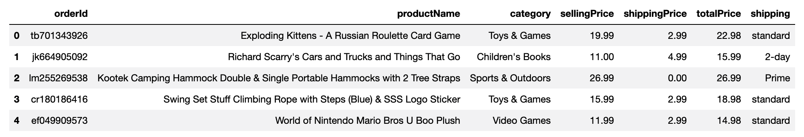

# Transforming and Cleaning Online Orders

In this activity, you'll transform and clean a dataset consisting of online orders.

## Instructions

Using the starter code provided, transform and clean the `online_orders.csv` dataset to create the following DataFrame. 

  

1. Create six columns from the one column; `orderId,productName,category,sellingPrice,shipping,totalPrice`. 

2. Create a new DataFrame with the six columns from step 1, then split the row values on the delimiter, `','` to populate the six columns.

3. Convert the "sellingPrice" and "totalPrice" columns to a `float` datatype.

4. Calculate the shipping price of each product and add it to a new column named, "shippingPrice."

5. Reorder the columns to match the image of the final DataFrame. 

---

© 2022 Trilogy Education Services, LLC, a 2U, Inc. brand.  Confidential and Proprietary.  All Rights Reserved.