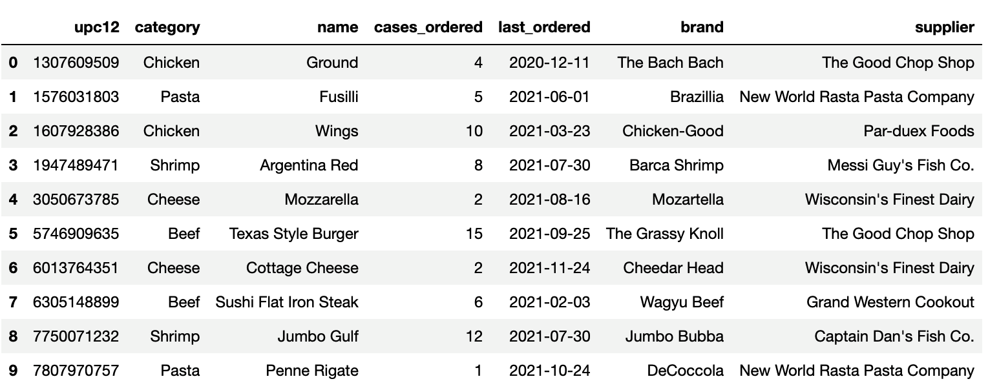

# Transforming and Cleaning Grocery Orders

## Instructions

Using the starter code provided, you'll read in the `grocery_orders.xlsx` into a new DataFrame, then transform the DataFrame to create a new DataFrame, which will be merged with  the DataFrame created from the `grocery_suppliers.csv` dataset. The merged DataFrame should look like the following image: 

  

1. Read the `grocery_orders.xlsx` file into a DataFrame. 

2. Create a new DataFrame by splitting the data in the lone column into four columns on the delimiter, `','`.

3. Convert the "upc12" column to an integer.

4. Convert the "cases_ordered" column to an integer. 

5. Convert the "last_ordered" column from UTC to a date.

6. Split the "item_name" column into two columns, one with the category and the other the item type.

7. Drop the "item_name" column and reorder the columns. 

8. Read in the `grocery_suppliers.csv` data into a DataFrame, check to make sure that the data types in both DataFrames match, and then merge the the two DataFrames.

---

© 2022 Trilogy Education Services, LLC, a 2U, Inc. brand.  Confidential and Proprietary.  All Rights Reserved.